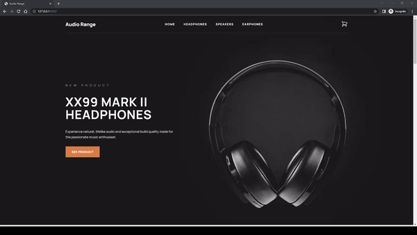

# Audio Range

An eCommerce that sells audio equipment custom built using Shopify CLI, Liquid, SCSS and jQuery.

## Table of contents

- [Screenshots](#screenshots)
- [Technologies](#technologies)
- [Contact](#contact)

## Screenshots

## Homepage

## Headphones Collections Page

## Speakers Collections Page

## Earphones Collections Page

## Product Page

## Cart Model

## Cart Page

## Technologies

- Shopify CLI
- Liquid
- SCSS
- jQuery
- Node.js and NPM
- Git & GitHub
- Visual Studio Code (IDE)
## Contact

Coded by Mo - [mocodes](https://mocodes.co.uk/)

Twitter: [@mocodes\_](https://twitter.com/mocodes_)